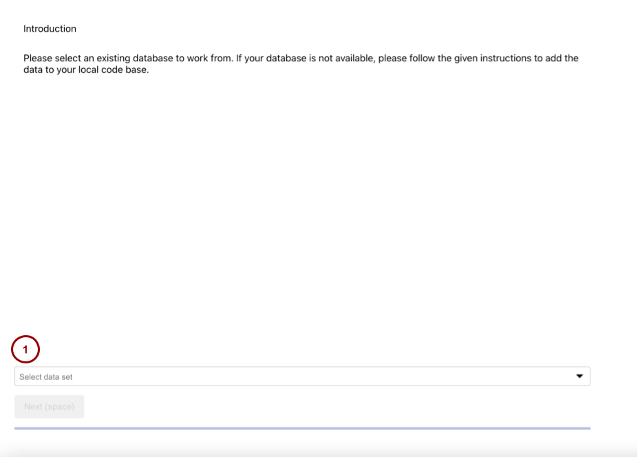
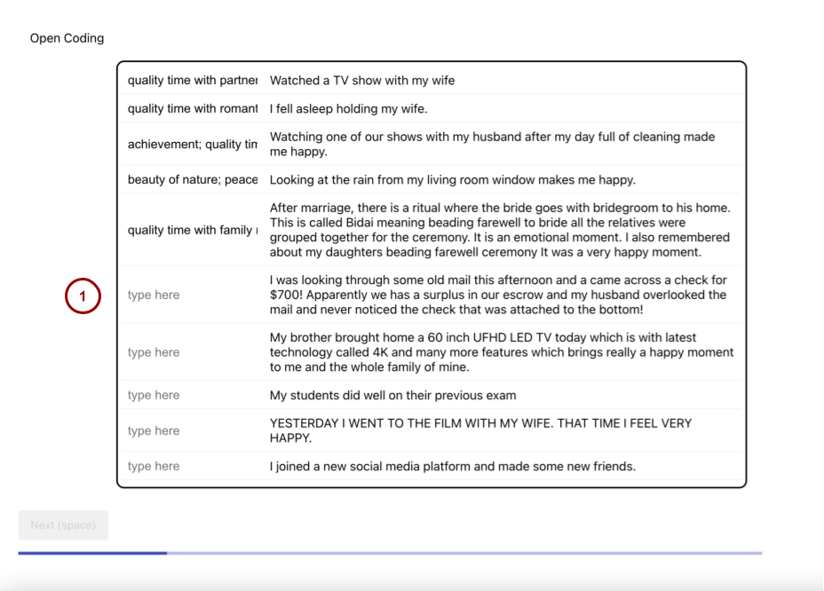
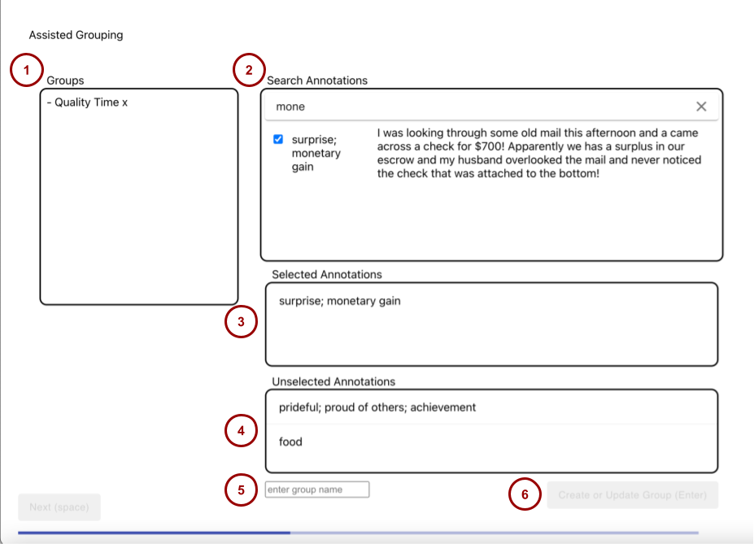
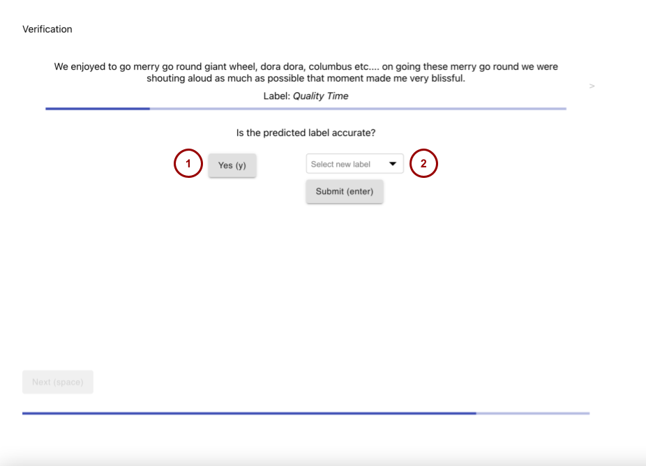
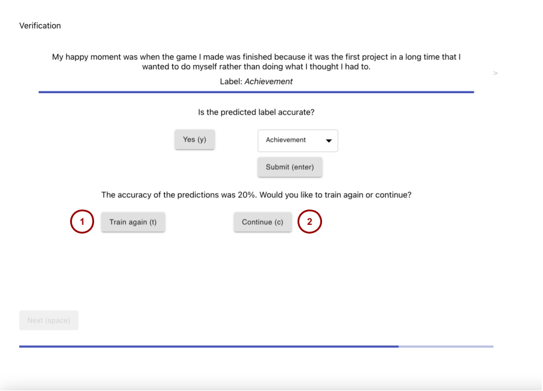
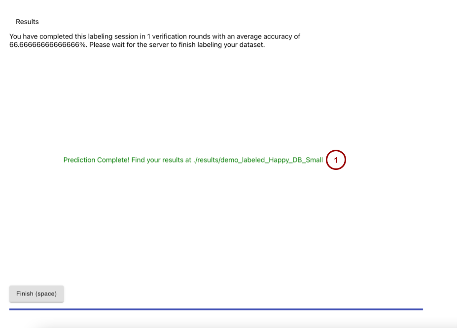

# Interface

In this directory is the source code for loading the interface (`/src`), and the the required package dependencies (`package.json` and `package-lock.json`). Within `src/Pages` is a separate folder for each page of the interface containing the relevant javascript files.

## Interface UI

Each interface page has a number of hot-keys available to make navigation easier, and they are explained in the following sub-sections for each interface page. Within every page, the `space` key can be used to navigate to the next page once a section is completed. 

### Introduction



This page is where the user can select a dataset to explore within the interface. The dropdown (see `1`) is populated from the csv files in `OpenCodingForMachineLearning/data`, and can be navigated with clicks.

### Open Coding



This page is where a user can freely annotate randomly-selected lines of text (see `1`) from the selected dataset. `tab` and `shift-tab` can be used after selecting an item to move up and down the page, and items can also be clicked to activate their respective text forms.

`enter` submits your newly-typed annotations, and the section completes once all items have submitted annotations.

The recommended user flow is:
1) Click the first text box item
2) Type in the relevant text input
3) Press `shift`
4) Repeat steps 2 & 3 until you reach the last text item
5) Type in the last text input
6) Press `enter`

### Assisted Grouping



After the page loads, the user will see all of their annotations and related text lines under "Unselected Annotations" (see `3`).

To group these annotations, users can navigate the search bar (see `2`) by using their mouse to click on the item. Users can then type a desired search query and press `enter` to prompt the search to execute. Once the search view populates, users can select text items.

After clicking on an item, the user will see that item populate under "Selected Annotations" (see `4`). Users can then use the lower text area to create a Group Name. 

Once a valid group name has been typed (see `5`), the "Create or Update Group" button (see `6`) will become available to click. This button can also be "pressed" via the hot-key `/`. 

<!-- TODO: update assisted grouping page image -->

The left-hand-side Groups area (see `1`) contains created groups, which can be expanded, deleted, and updated. To expand a group, click on the "`*`" icon next to the group's name. To delete a group, click on the "`x`" icon. To update a group, click on the group's name and return to the search/select interactions. 

This section completes once all annotations are in at least once group.

### Verification



This page is where the user enters a feedback loop with the OpenCodingModel, verifying the accaruacy of a given prediction or adjusting the prediction as needed.

The `y` hotkey (see `1`) is available to verify that a prediction is accurate, and the dropdown (see `2`) is available to adjust predictions. After selecting a new label, the `enter` hotkey can be used to submit the selection.

Pressing "Yes" or Pressing "Submit" automatically moves the user onto the next prediction.


Once all predictions have been verified or corrected, the "Retrain or Continue" modal appears.



Then, the user can either "Train again" (`t` hotkey, see `1`) or "Continue" (`c` hotkey, see `2`). "Train again" will present more predictions to the user, whereas "Continue" will complete the section and allow the user to move on to the next page. 

### Results



This page prompts the OpenCodingModel to label the rest of the dataset, and once complete, prompts the user with wheere they should look in `/results/` (see `1`). 

## Development Instructions

This project was bootstrapped with [Create React App](https://github.com/facebook/create-react-app). 

npm must be installed to run this interface ([MacOS example](https://changelog.com/posts/install-node-js-with-homebrew-on-os-x)). After installing npm, to install rest of the necessary dependences, run

```
$ npm install
$ npm install node-fetch@2
```


> **_NOTE_** 
> 
> "npm install node-fetch@2" is required to install > v2 of npm-fetch, as v3 is an esm-only module. 
> node-fetch allows the interface to interact with the server's api.

Server requests not working? Try

```
$ rm -r package-lock.json node_dules
$ npm install
```

After completing installations, the following command starts the interface in the browser ([http://localhost:3000](http://localhost:3000)):

```
$ npm start
```

> **_IMPORTANT_** 
> 
> Please make sure to follow the development instructions in `/server/README.md` before starting the interface,or there will be no server for the interface to request data from.

---

## Available Scripts for Development

In the project directory, you can run:

### `npm start`

Runs the app in the development mode.\
Open [http://localhost:3000](http://localhost:3000) to view it in the browser.

The page will reload if you make edits.\
You will also see any lint errors in the console.

You may notice a 'Failed to compile' message - simply install the unresolved modules using `npm install [module name]`. 

### `npm test`

Launches the test runner in the interactive watch mode.\
See the section about [running tests](https://facebook.github.io/create-react-app/docs/running-tests) for more information.

### `npm run build`

Builds the app for production to the `build` folder.\
It correctly bundles React in production mode and optimizes the build for the best performance.

The build is minified and the filenames include the hashes.\
Your app is ready to be deployed!

See the section about [deployment](https://facebook.github.io/create-react-app/docs/deployment) for more information.

### `npm run eject`

**Note: this is a one-way operation. Once you `eject`, you can’t go back!**

If you aren’t satisfied with the build tool and configuration choices, you can `eject` at any time. This command will remove the single build dependency from your project.

Instead, it will copy all the configuration files and the transitive dependencies (webpack, Babel, ESLint, etc) right into your project so you have full control over them. All of the commands except `eject` will still work, but they will point to the copied scripts so you can tweak them. At this point you’re on your own.

You don’t have to ever use `eject`. The curated feature set is suitable for small and middle deployments, and you shouldn’t feel obligated to use this feature. However we understand that this tool wouldn’t be useful if you couldn’t customize it when you are ready for it.

## Learn More about Create React

You can learn more in the [Create React App documentation](https://facebook.github.io/create-react-app/docs/getting-started).

To learn React, check out the [React documentation](https://reactjs.org/).

